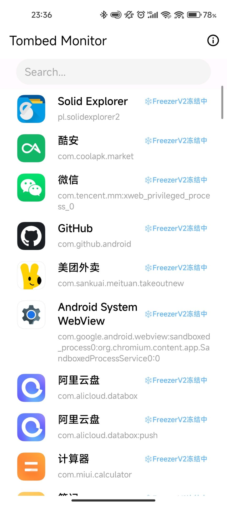

# Tombed Monitor

> 此工具需要Root权限

## 简介

安卓进程墓碑状态监视工具，用于实时监视`FreezerV1/V2/SIGSTOP`等墓碑冻结状态的APP和进程；可用于各种墓碑模块及系统墓碑机制（如millet）实时效果检查。

**Best Practice**：启动APP后小窗挂在右上角，实时观察运行效果。

## 说明

正常情况下，此应用启动后，会定时轮询并将已被墓碑冻结的应用显示在应用列表中。右侧显示的`FreezerV1/FreezerV1/SIGSTOP`为墓碑所实际使用的冻结方式。

应用列表上方的搜索框可以按应用名或包名筛选显示。

## 异常情况

如果此APP正常启动没有报错，且应用列表一直为空，一般表示如下几种可能：

- 墓碑模块或者墓碑机制没有生效，或者有不兼容冲突的情况导致无法冻结应用。
- 墓碑已经生效，但是没有成功冻结应用。可以尝试更改冻结方式。

如果应用列表显示正常，但是其中经常出现某些应用反复消失又出现的情况，一般表示：

- 此墓碑模块/机制效果不佳，可能冻不住那些反复跳动的应用。
- 之前对这些应用开启了网络唤醒/binder唤醒。在这种情况下出现应用跳动属于正常现象，不用额外处理。

## 运行截图

## TODO

随手写的，很简陋，能用就行。有空再完善。咕咕（

欢迎在issue反馈bug。

## 致谢

感谢 冻它 作者JARK006，基本是按他的脚本套了个UI可视化（乐）。欢迎大家去酷安尝试 冻它 墓碑模块

UI设计部分参考myflavor大佬的[NoActive-UI](https://github.com/myflavor/NoActive-UI)，强大好用的开源墓碑模块，同样欢迎大家的尝试和体验。
